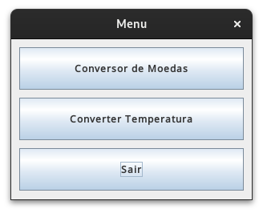

# Conversor de moedas Java

Desafio Alura One Conversor de moedas

Features:

- Menu
- Conversor de moedas
- (Extra) Conversor de temperatura

## Menu

Opções disponíveis:

- Conversor de moedas
- Conversor de temperatura
- Sair

## Conversor de moedas

Opções de moedas disponíveis:

- Real
- Dólar
- Euro
- Libras Esterlinas
- Peso Argentino
- Peso Chileno

Extras:

- Uso de API de cotação para obter o valor atualizado da moeda atual.

  Api utilizada: https://docs.awesomeapi.com.br/api-de-moedas

## Conversor de temperatura

Opções de temperatura disponíveis:

- Celsius
- Fahrenheit
- Kelvin

## ScreenShots

